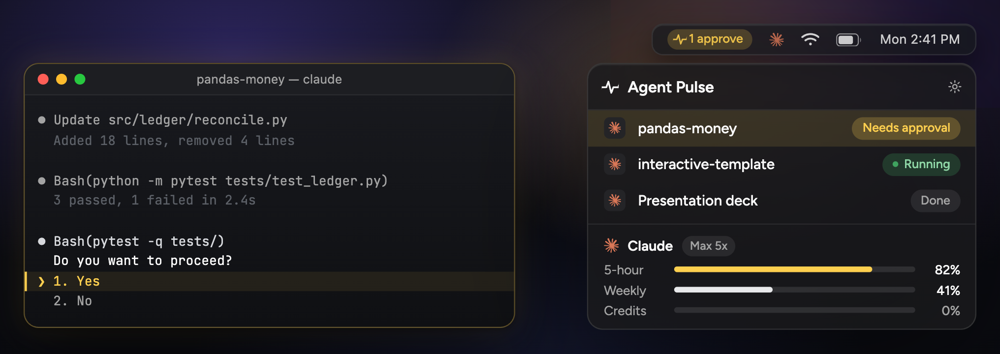

# Agent Pulse

A macOS menu bar app that shows whether your AI coding agents are working,
waiting on you, or done — and takes you back to the one that's blocked.



## Why

Running two or three coding agents at once sounds productive until you realize
where the time actually goes: an agent stops to ask for permission, and you
don't find out for ten minutes because you were looking at something else.
The work isn't slow — the *noticing* is slow.

Existing tools notify you that something finished. That's the easy half. The
hard half is being told the moment something **stops needing to run and starts
needing you**, and then getting back to that exact session without hunting
through terminal tabs and browser windows.

That's the whole app.

## What it does

**Knows the moment an agent blocks.** Claude Code's `Notification` hook fires
the instant a tool needs approval. No polling, no scraping the terminal.

**Covers terminal and browser in one line.** Claude Code, Codex, and Antigravity
report through hooks; claude.ai, Claude Design, and ChatGPT are watched by a
Chrome extension that intercepts the network layer rather than the DOM — so a
UI redesign doesn't break it.

**Click takes you back.** The notification jumps to the terminal or the exact
browser tab the session started in, based on where it was launched.

**Shows what's actually left.** Real 5-hour, weekly, and credit limits pulled
from your own account, plus per-project token consumption.

Everything runs locally. The app listens on `127.0.0.1`; nothing is sent
anywhere.

## Status

Working, and in daily use by two people. Not signed or notarized yet, so it
isn't distributable outside of "here, run this" — that needs an Apple Developer
account, which is the next step rather than a technical problem.

## Running it

Requires macOS 14+ and Swift 5.9+.

```bash
git clone https://github.com/cloiekim/agent-pulse.git
cd agent-pulse
./scripts/make-app.sh && open AgentPulse.app
```

Then wire up whichever agents you use:

```bash
./scripts/install-claude-hooks.sh        # Claude Code
./scripts/install-codex-notify.sh        # Codex CLI
./scripts/install-antigravity-hooks.sh   # Antigravity
```

For browser sessions, load `chrome-extension/` as an unpacked extension in
`chrome://extensions` and turn on site access for `claude.ai`, `chatgpt.com`,
and `127.0.0.1`. Pairing is automatic.

`./scripts/uninstall.sh` removes everything it installed.

## How it's put together

```
Sources/AgentPulse/
  Ingest/      hook + extension events → a single event stream
  Store/       events folded into "what each session is doing right now"
  Views/       menu bar item, popover, settings
  Design/      tokens, brand marks, the menu bar renderer
chrome-extension/
  src/inject.js    MAIN-world fetch/EventSource interception
  src/background.js  service worker: state relay + usage polling
```

Two decisions shaped most of the code.

**The menu bar item is drawn as a single image.** SwiftUI's `MenuBarExtra`
collapses arbitrary views to zero width, and neither `@AppStorage` nor
`onChange` propagates into its label. Everything the item shows is rendered to
one `NSImage` and pushed from an observable the label already watches.

**The browser watcher hooks the network, not the DOM.** Every abandoned
ChatGPT-notifier extension polled CSS classes and broke on the next redesign.
Intercepting `fetch` and `EventSource` survives visual changes, because request
shapes move far more slowly than markup.

## A note on the numbers

Nothing on screen is estimated. If a value can't be derived from something real
— a hook payload, a log line, an account API — it isn't shown. Several things
were removed for failing that test: an invented reset countdown for Codex
(OpenAI dropped 5-hour windows in July 2026), a timer-based approval detector
that guessed wrong three times, and a token total that was counting cached
context re-sends as new work.

Code comments and commit messages are in Korean.

Built by [Chloe Kim](https://github.com/cloiekim), a product designer, with
Claude Code.
